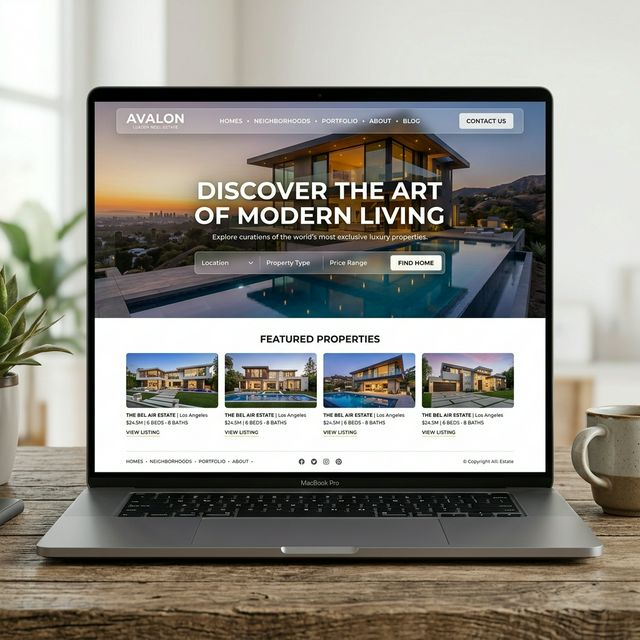

# NovaNest – Premium Real Estate Experience



## Overview
NovaNest is a state-of-the-art real estate platform offering a premium, luxury property browsing experience. It combines a clean, modern aesthetic with smooth micro-interactions to deliver a truly professional interface that elevates the real estate discovery process.

## Features
- **Clean UI & Modern Aesthetics:** Designed with elegant typography and whitespace management.
- **Fully Responsive:** Perfectly adapts to desktops, tablets, and mobile devices.
- **Smooth Animations:** Integrated with Framer Motion for delightful scrolling and interface animations.
- **Premium Interactivity:** Dynamic hover states, active links, and polished navigation.

## Tech Stack
- React 19
- Vite
- TypeScript
- Tailwind CSS
- Framer Motion
- React Three Fiber / Drei
- Zustand (State Management)
- Lucide React (Icons)
- React Router DOM

## Setup Instructions
To run this project locally, execute the following commands in your terminal:

```bash
# Install dependencies
npm install

# Start the development server
npm run dev
```

## Branch Information
This UI revamp is currently available on the `revamp-ui` branch.

## Author
knockknock10 (Developed as part of a complete frontend redesign)
